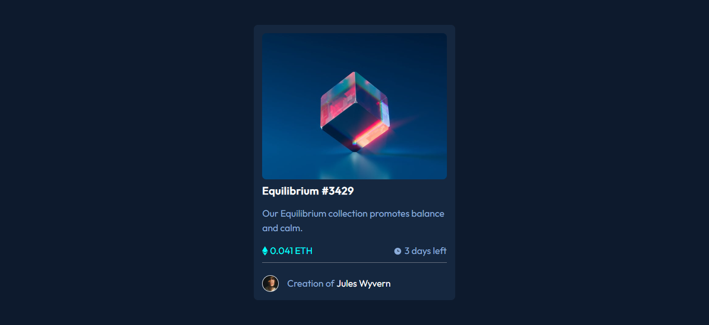

# Frontend Mentor - NFT preview card component solution

This is a solution to the [NFT preview card component challenge on Frontend Mentor](https://www.frontendmentor.io/challenges/nft-preview-card-component-SbdUL_w0U).

## Table of contents

  - [Overview](#overview)
  - [Screenshot](#screenshot)
  - [Built with](#built-with)
  - [What I learned](#what-i-learned)
  - [Useful resources](#useful-resources)

## Overview

### Screenshot

### Links

- Solution URL: [gitub repo](https://github.com/Schismond/nft-preview-card/)
- Live Site URL: [gitub pages](https://schismond.github.io/nft-preview-card/)

## My process

Analyze the layout and structure of the webpage.
Create the HTML skeleton of the webpage.
Add content to the webpage using HTML tags.
Add images and media files to the webpage.
Style the webpage using Tailwindcss classes.
Test the webpage on different browsers and devices to ensure it's responsive and functional.
Make necessary adjustments and improvements to the webpage based on the testing results.

### Built with

- Semantic HTML5 markup
- CSS custom properties
- Flexbox
- CSS Grid
- Mobile-first workflow
- [Tailwind](https://tailwindcss.com) - CSS framework

### What I learned

This project was definitely a challenge, but it was also an incredible opportunity to learn and improve my frontend development skills. I was able to hone my skills in responsive design. It's amazing how much you can learn by tackling a project like this, and I feel like I've really expanded my understanding of frontend development as a result. I'm so glad I took on this project, and I can't wait to see what I'll be able to accomplish next!

### Useful resources

- [Tailwindcss documentation](https://tailwindcss.com) - This helped me to quickly find the informations I needed , it's quick and easy an efficient